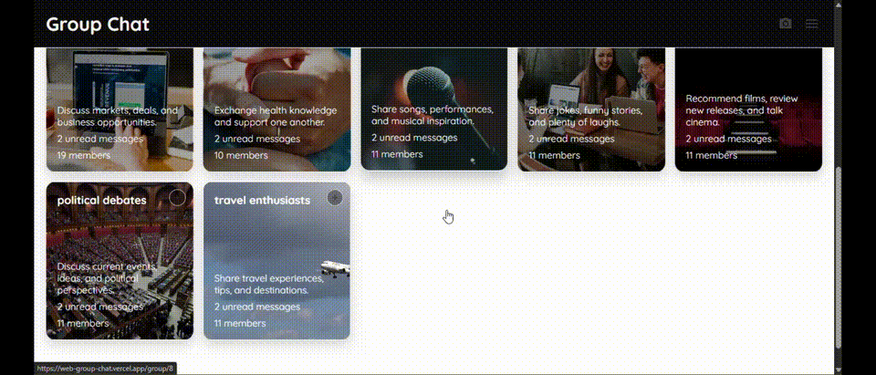

# Group Chat

## Demo



A React single-page application for browsing discussion groups and opening lightweight group direct messages.

## Features

- Browse groups displayed as image-backed cards.
- Filter groups by category or search by title and category.
- Open a group at `/group/:groupId` using React Router.
- Pin groups to the bottom task bar from the home page.
- Send messages in pinned groups during the current session.
- Remove pinned groups and switch between them from the task bar.
- Responsive layout for desktop and mobile screens.

## Requirements

- Node.js 16 or newer
- npm

## Getting Started

Install dependencies, then start the development server:

```bash
npm install
npm start
```

Open [http://localhost:3000](http://localhost:3000) in a browser.

## Available Scripts

| Command | Description |
| --- | --- |
| `npm start` | Starts the development server. |
| `npm run build` | Creates an optimized production build in `build/`. |
| `npm test` | Runs the test runner. |
| `npm run eject` | Ejects Create React App configuration. This is irreversible. |

## Project Structure

```text
src/
├── App.js              # Router and application state
├── GroupDM.js          # Group conversation view
├── Navbar.js           # Home-page navigation and menu
├── home.js             # Search, category filters, and group cards
├── task-bar.js         # Pinned group navigation
├── index.css           # Application styles
├── index.js            # React entry point
└── data/groups.js      # Local group and message seed data
```

## Data and Limitations

Groups and initial messages are stored in `src/data/groups.js`. New messages and pinned groups are held in React state, so they are reset when the page is refreshed. There is currently no backend, authentication, persistence, or real-time messaging service.

Group card images are loaded from Unsplash URLs and require network access.

## Validation

Build the project before deployment:

```bash
npm run build
```

The repository currently does not contain automated test files, so `npm test` exits with a no-tests status until tests are added.
